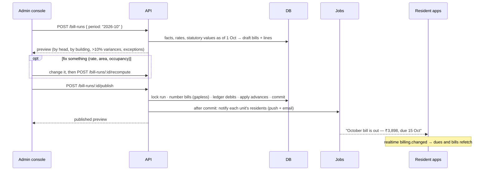

# Flow: a month's billing

Actors: the treasurer or secretary (admin console, `billing.generate` /
`billing.publish`), then residents. Rules: [../modules/billing.md](../modules/billing.md).

**Before publishing, check:**
- **Exceptions:** units with no carpet area (per-area heads), buildings without
  a construction cost (fund heads), units without a primary owner, a
  non-occupancy rate over the cap.
- **Variances:** a unit whose bill moved more than 10% usually means a changed
  area, occupancy or rate.
- **Interest:** only units with overdue principal carry an interest line, and
  its basis names the bills and days.

**After publishing:**
- The run's bills can't change. To correct one, cancel an unpaid bill
  (`billing.cancelBill`) or issue a credit note (`billing.creditNote`).
- Rates can no longer be set inside the published period. The next rate
  change starts after it.
- Residents see the bill with every line's basis, and pay it:
  [paying-dues.md](paying-dues.md).
- The bill register report for the period is available in Reports.
