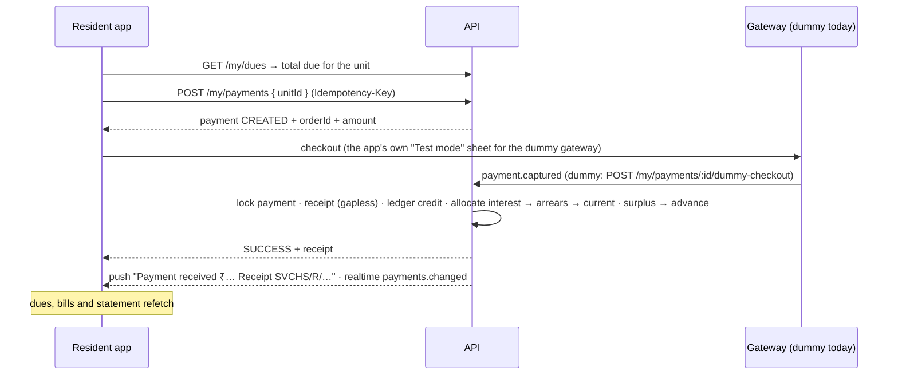

# Flow: paying dues

Rules: [../modules/payments.md](../modules/payments.md).

## Online, from the resident app

A failed checkout marks the payment FAILED with a reason; nothing is
charged, and the resident can try again. A checkout abandoned for 30
minutes is cancelled by a job.

With a real gateway, the gateway calls `POST /webhooks/payments/:gateway`
(signed, idempotent), and the same confirmation path runs.

## At the society office

1. **Cash, NEFT, UPI and similar** (`payments.record`): the treasurer enters the
   unit, amount, mode, date and reference, and the receipt is issued
   immediately.
2. **Cheque:** it's recorded as PENDING, with no receipt yet. On clearing,
   `payments.chequeAction { action: "clear" }` issues the receipt and
   allocates the money. On a bounce, `bounce` marks it FAILED, and nothing
   was ever applied.
3. **Mistakes:** `payments.cancelReceipt { reason }` reverses the allocations,
   cancels the receipt and posts a ledger reversal. The bills are owed again.
