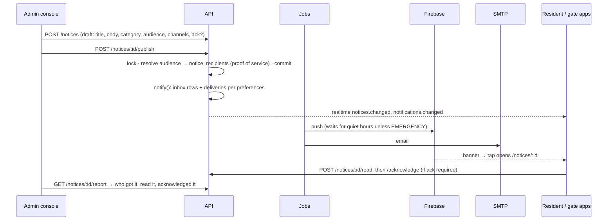

# Flow: telling residents something

Rules: [../modules/notices-and-notifications.md](../modules/notices-and-notifications.md).

**Details:**
- **Emergencies:** an EMERGENCY notice needs a reason, which is logged. It
  goes out immediately on the high-priority emergency channel, and nobody
  can mute it.
- **Corrections:** a published notice is a record. To fix one, publish a
  correction with `supersedesId`; the original becomes SUPERSEDED and links
  to the correction.
- **Proof of service:** the report exports as Excel or CSV
  (`reports.email`, type `notice-delivery`).
