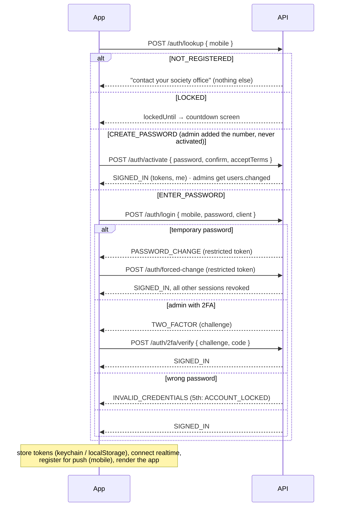

# Flow: signing in

Applies to all three apps. The screens differ, but every app calls the same
`SessionController` methods. Rules: [../modules/auth.md](../modules/auth.md).

**After sign-in:**
- **Token refresh:** the client refreshes the 15-minute access token before it
  expires, and once more on any 401. The refresh token rotates each time.
- **Session ending elsewhere:** if the session is revoked elsewhere (another
  device's "log out all", an admin's force logout, a suspension), the next
  request gets 401. The socket also receives `session.revoked`, and the app
  returns to sign-in.
- **App restart:** `session.restore()` validates the stored tokens with
  `GET /me`. If the server can't be reached, the tokens are kept and the app
  offers a retry.

**Forgotten password:**
1. There's no self-service reset. The user asks the society office.
2. An admin issues a temporary password from Users & access. It's shown once,
   with a WhatsApp share link, and also sent by SMS and email.
3. The user signs in with it and must set a new password before anything else.
